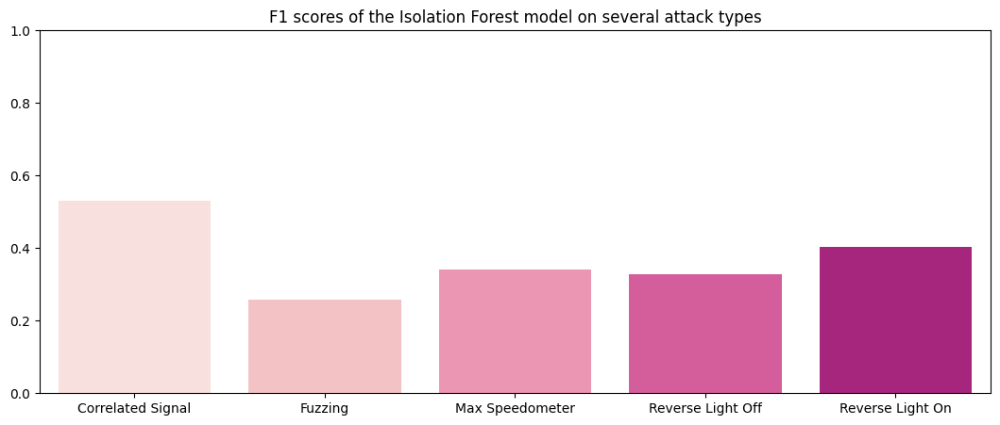
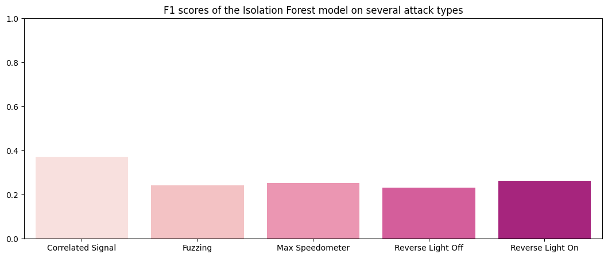
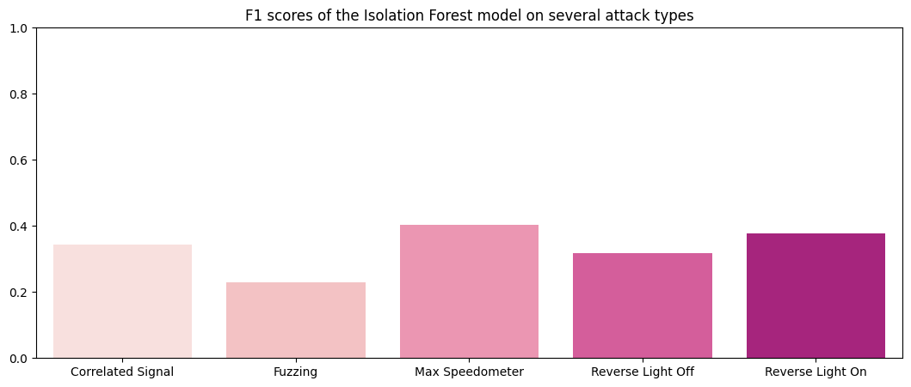

# Detecting Attacks on CAN Data
Heads up: the code for this project, along with explanations in markdown cells and comments, can be found [here](https://github.com/akin-oladejo/can-anomaly-detection-v2) 

## The Task
The Controller Area Network (CAN) is currently the most widely-used in-vehicle networking protocol. CAN is a bi-directional, multi-master, serial bus that uses UTP cabling to ensure reliability in electromagnetically noisy environments.
It provides an effective method for the components of a vehicle called the Electronic Control Units (ECU) to communicate among themselves, as opposed to traditional point-to-point wiring. It is also used in industrial applications as the basis for Devicenet, reducing the wiring needed between a control system and I/O devices.

While it provides a means to communicate reliably, CAN is not known for security. Modern vehicles allow you to plug in devices that can communicate on this network through the OBD-II port or some other port like the USB. Also, some of the devices in modern vehicles that use the CAN are connected to the internet, allowing external attacks in various forms. These attacks include Replay, Spoofing, Denial of Service (DOS) and so on.  

The task in this project was to **detect attacks on the CAN**.  
  
This was done using different methods. The methods were:
1. Frequency-based detection  
Frequency-based methods use the increase in CAN transmission during attacks as the heuristic for detection.
2. Payload-based detection  
Payload-based methods read the data that is transmitted and detect when the data is unusual or unexpected. I implemented two payload-based detection models, one using the Isolation Forest algorithm (tree-based anomaly detection) and the second using an autoencoder (reconstruction error).

## The Dataset
The dataset used in this project is the **Real ORNL Automotive Dynamometer (ROAD) CAN Intrusion Dataset**, from (Verma et al., 2020). It can be found [here](https://0xsam.com/road/). The dataset contains over 3.5 hours of an unspecified vehicle’s CAN logs. ROAD contains ambient data recorded during a diverse set of activities, and attacks of increasing stealth with multiple variants and instances of real fuzzing, fabrication, and unique advanced attacks, as well as simulated masquerade attacks. In the paper, the authors discuss that the purpose of the dataset is to provide a CAN benchmark dataset free of the problems of previous public datasets such as the lack of comparability and the inconsistency of CAN message intervals due to the insertion of synthetic data post-recording.

The dataset consists of three folders: ambient, attacks and signal extractions.

Ambient data is ground truth — a recording of CAN transmission in the vehicle during regular (attack-free) driving. Several log files are provided but each log was either during highway driving or while on a dynamometer (dyno, for short).

The signal extractions folder contains the same CAN data found in the ambient and attack folders, except that the signals have already been translated from hexadecimal to decimal numbers.

The attacks in the dataset are:
1. **Accelerator attack**   
This is an exploit of a vulnerability particular to the vehicle the authors tested. The CAN data of the exploit was not given, rather the CAN transmission as the vehicle suffered the exploit. Because of its peculiarity to this vehicle, this attack was not included in the data I used to train the intrusion detection systems.
1. **Correlated signal attack**  
The single ID message communicating the four wheels’ speeds (each is a two-byte signal) was injected with four false wheel speed values that were all pairwise very different. This effectively killed the car as it rolled to a stop and inhibited the driver from effecting acceleration, usually until the car was restarted.
1. **Fuzzing attack**  
The authors mounted the less stealthy version of the fuzzing attack, injecting frames with random IDs (cycling in order from 0x000 to 0x255) with maximum payloads (0xFFFFFFFFFFFFFFFF) every .005s (as opposed to only injected IDs seen in ambient data). Many physical effects of this attack were observed: accelerator pedal became impotent, dash and lights activated, seat positions moved, etc. By injecting messages with maximal payload, the authors prevented incidental ECU bus-off (a state when an ECU is not allowed to communicate due to a possible error). With the exception of the accelerator attack, every other attack targeted a specific ID.
1. **Max engine coolant temperature attack**  
The authors targeted the engine coolant signal (one byte), modifying the signal value to be the maximum (0xFF). The result was that the “engine coolant too high” warning light on the dashboard turned on.
1. **Max speedometer attack**  
The speedometer signal (one byte) was targeted. The authors modified this signal value to be the maximum (0xFF), causing the speedometer to falsely display a maximum value.
1. **Reverse light attacks**
A binary (one bit) signal communicating the state of the reverse lights (on/off) was targeted. The authors performed two slight variations of the attack, where they manipulated the value to off while the car was in Reverse or on when the car was in Drive. The consequence was that the reverse lights did not reflect what gear the car was using.

For all attacks except the accelerator attack, both original fabrication and masquerade versions were provided by the authors. The Fabrication attacks were the attacks as they took place in ***flam*** fashion. Flam attacks, introduced by Hoppe, Kiltz, and Dittmann (2011), are a clever way to game the Controller Area Network by injecting malicious data <ins>immediately</ins> after authentic ID transmission so that malicious data can be read as though it came from a valid ID. The indirect effect is that there are more messages transmitted during attacks. This side effect is why the first approach I used, the frequency-based detection, was effective at detecting attacks.

The masquerade version contained only the spoofed data when attacks occurred, because the authors performed some post-processing to remove the normal transmission of the targeted ID's, without violating the CAN protocol. Note that for masquerade attacks, frequency-based methods are not likely to work.

For training, tuning and testing, fabrication (flam) data was used. 

## An Overview of the Methods
All three methods were designed to solve the problem of intrusion detection by framing it as a <ins>novelty detection</ins> problem. With novelty detection, any data point that does not conform to the properties of data an algorithm is presented with during training is considered novel (in this case, an attack).

### Why novelty detection?
The problem with attack data is that they resemble normal data, making them difficult to detect. Consider the following attacks:
- Denial of Service (DOS)  
A DOS attack occurs when data is transmitted so many times using a high priority ID e.g `0`, so that proper functioning of the CAN is inhibited. The payload may even be regular signals, even if the ID is not regularly seen.
- Replay attack  
 A replay attack is the repeated transmission of data from a single ID to fool the protocol, launch a masquerade attack etc. The ID and payload may be valid, however the ECU has been compromised.

This posed a question — how can an algorithm tell this kind of data apart from regular, normal data? The answer is a principle backing many implementations of CAN intrusion detection systems in research: the context of attack transmission is different from regular transmission. Here are some context clues for when there is an attack:
1. Usually, attacks *increase CAN transmission rates*. This is demonstrated in (Young, Olufowobi, Bloom & Zambreno, 2019) and was, as stated earlier, the basis of method 1.
2. Some arbitration ID's *are not seen as often*, or even ever. Perhaps an increase in transmission rates from an ID indicates an anomaly. What happens when an arbitration ID that never transmits normally suddenly starts transmitting? Will that help identify anomalies?
3. Attack data can *contain weird payloads*. Take for instance the fuzzing and targeted ID attacks.

Methods 2 and 3 utilised the second and third context clues. It was therefore reasonable to study the context of regular transmission and use these clues to discriminate the transmission of attacks. Thus, the framing of the problem as novelty detection.

## Scoring and Testing the methods
It is not enough that a model detects anomalies. If a model predicts wrongly most of the time, the incessance will become annoying. Vehicle owners would want a model to detect as many anomalies as possible but not to the point where there are many spurious detections. Hence, each model would have to score a high true positive rate for the attack class and a low false positive rate so we don't end up with an incessant detector. A good CAN intrusion detection model is one that balances precision and recall. Thus, the F1 score was chosen as metric.

### A Pattern to the Three Approaches
For uniformity, each method was modeled as a class that defines the following methods:
- `__init__()`  
While the different classes pertaining to each method contain different attributes and call different methods upon object initialization, the different classes initialize a common attribute: `attack_f1`. `attack_f1` is a dictionary to store the F1 scores of each model on the different attack datasets. These values can then be visualized using the `chart_f1()` method.
- `fit()`  
The different methods follow a common principle: learn the representation of normal activity. The `fit` method does this differently for each method: for method 1 (message frequency detection), it learns the message frequency during attack-free transmission; for method 2 (isolation forest), it learns anomaly scores; for method 3 (autoencoder), it learns a latent representation of normal data to arrive at a threshold error of reconstruction.
- `detect_anomalies()`  
This method uses the model's internal representation of normal data to detect an anomaly. When predictions have been made, it prints the classification report and stores the F1 score of the model on the target attack in the model's `attack_f1` attribute.
- `chart_f1()`  
Each class defines a `chart_f1()` method to visualize the performance of the model on the different attack datasets as a barplot of F1 values.

The similarity of the three classes made it possible to define a single testing function, `test_method`, that runs the `detect_anomalies()` method for each attack type and visualizes their F1 scores:

## Method 1: Frequency-based Detection
Young, Olufowobi, Bloom & Zambreno (2019) propose that a more than double increase in the frequency of CAN message transmission is a simple indicator that there are anomalies in a CAN bus.

To implement this idea, a class, `Freq`, is defined. It defines a window (here, one second) and determines the average number of normal messages transmitted in that window. At inference time, if the frequency is greater than a given threshold, there is an anomaly. Recall the first context clue.

Note that this method only cares about *how many* messages are transmitted in each window and not what those messages are. Therefore, the `Freq.fit()` implementation ignored CAN data and only counted messages per second. That average number of messages per second during normal CAN transmission was stored as `normal_rate` and then used to discriminate anomalies at inference time.

### Results (pre-tuning)
```
F1 Scores of the Frequency Detection method:
Correlated Signal   : 0.0
Fuzzing             : 0.0
Max Speedometer     : 0.0
Reverse Light Off   : 0.0
Reverse Light On    : 0.0
```


### Tuning
Note that in the original paper, the authors' decision to make the threshold `2` (meaning that when the transmission rate doubles, there is an attack) may have been influenced by the nature of attacks they studied: synthetic injection attacks added in post-processing. The poor performance of the model could be alleviated by using a more lenient value for threshold.   
  
Therefore, I set the threshold value to 1.003 (so if there are on average 1405 messages per second, 1410 messages in a single second will indicate an attack). The tuning was tested on the same test data but evaluated against the validation (holdout) data to avoid data leakage.

Performance on test data:
```
F1 Scores of the Frequency Detection method:
Correlated Signal   : 0.97674
Fuzzing             : 0.66667
Max Speedometer     : 1.0
Reverse Light Off   : 1.0
Reverse Light On    : 0.97674
```


### Results (post-tuning)
This is the performance of the tuned model on the holdout set:
```
F1 Scores of the Frequency Detection method:
Correlated Signal   : 0.97778
Fuzzing             : 0.8
Max Speedometer     : 1.0
Reverse Light Off   : 1.0
Reverse Light On    : 0.98701
```

Perfect! The frequency-based method was successful in detecting flam attacks in both the test and validation datasets, achieving near-perfect results.
## Method 2: Tree-based Anomaly Detection
One popular unsupervised algorithm for anomaly/novelty detection is the Isolation Forest proposed by Liu, Ting, & Zhou (2008). It works by computing the anomaly score of data points as the number of times it is partitioned. It considers as outliers the samples that have a low anomaly score (these samples were easier to partition).

Isolation Forest performs the following steps to detect an anomaly:
1. recursively partition the data into smaller and smaller subsets
2. at each step, a random feature and a random split value are chosen
3. the anomaly score for each data point is calculated as the number of times a data point is partitioned
4. data points with lower anomaly scores are more likely to be anomalies.

### Results (pre-tuning)
How did the Isolation Forest method perform initially?
```
F1 Scores of the Isolation Forest method:
Correlated Signal   : 0.53066
Fuzzing             : 0.2586
Max Speedometer     : 0.34051
Reverse Light Off   : 0.32797
Reverse Light On    : 0.40323
```


### Tuning
The `IsolationForest` implementation in sklearn has several hyperparameters including
- `n_estimators`: the number of base estimators in the ensemble  
- `max_samples`: the number of samples to draw from X to train each base estimator.
- `max_features`: the number of features to draw from X to train each base estimator.

To tune this model, the `HalvingGridSearchCV` was used. `HalvingGridSearchCV` is an elimination variant of the exhaustive Grid Search which excludes poor performing hyperparameter combinations in successive stages like a tournament. Using this search method across the given hyperparameter space, we are able to save time and computation resources as opposed to using `GridSearchCV`.

Note that there was a slight workaround for the tuning step: all attack data in the test folder were used for tuning. After tuning, the updated `IsolationForest` was tested on each attacks in the validation set. 

The hyperparameter search revealed a combination of `max_samples=1` and `n_estimators=200` to be the best provided candidate for the combined dataset. Let's see how it performed on the test set:

```
F1 Scores of the Isolation Forest method:
Correlated Signal   : 0.37148
Fuzzing             : 0.24352
Max Speedometer     : 0.25246
Reverse Light Off   : 0.23071
Reverse Light On    : 0.26364
```

### Results (post-tuning)
This is the performance of the tuned model on the holdout set:
```
F1 Scores of the Isolation Forest method:
Correlated Signal   : 0.34452
Fuzzing             : 0.22838
Max Speedometer     : 0.40417
Reverse Light Off   : 0.31878
Reverse Light On    : 0.37835
```


As can be seen from the performance above, the tuned model did not exactly perform better. How did the original (untuned) model perform on the validation data?
```
F1 Scores of the Isolation Forest method:
Correlated Signal   : 0.55719
Fuzzing             : 0.2649
Max Speedometer     : 0.45226
Reverse Light Off   : 0.51073
Reverse Light On    : 0.44284
```


Looks like the isolation forest method had average performance at detecting attacks on CAN data.
## Method 3: Reconstruction Error
Autoencoders are a deep-learning architecture with a quirk: the input and output layers have the same number of neurons, with a bottleneck in between. Basically, they are trained to copy their input to their output. They can be used for several purposes such as compression, image denoising and anomaly detection. To use an autoencoder for anomaly detection, you would train it on normal data and define a threshold on the error of reconstruction to discriminate data it has not seen before. If the error of reconstruction of a data point exceeds that threshold, that data point is an anomaly. Fawaz Waselallah Alsaade and Mosleh Hmoud Al-Adhaileh (2023) employ the autoencoder approach to solve the intrusion detection problem for CAN data.

For the `AutoEncoder` class I implemented, the threshold of choice is 3 standard deviations from the mean of errors of reconstruction. The process was as follows:
1. Train the autoencoder on normal CAN data
2. Reconstruct the input and obtain the errors of reconstruction as an array/tensor
3. Compute the standard deviation (denoted σ) of the errors
4. Define the threshold as a z-score of 3, or 3σ. Thus if the absolute value of the error, e, is greater than 3 standard deviations from the mean of regular errors, the data point belongs to an attack.

For visual aid, any data point that falls in the 0.1% would be determined an attack  
  
Source: [M. W. Toews](https://upload.wikimedia.org/wikipedia/commons/thumb/8/8c/Standard_deviation_diagram.svg/600px-Standard_deviation_diagram.svg.png?20150115020654), [CC BY 2.5](https://creativecommons.org/licenses/by/2.5), via Wikimedia Commons

### Results (pre-tuning)
```
F1 Scores of the Autoencoder method:
Correlated Signal   : 0.22257
Fuzzing             : 0.19137
Max Speedometer     : 0.16274
Reverse Light Off   : 0.17161
Reverse Light On    : 0.20416
```

